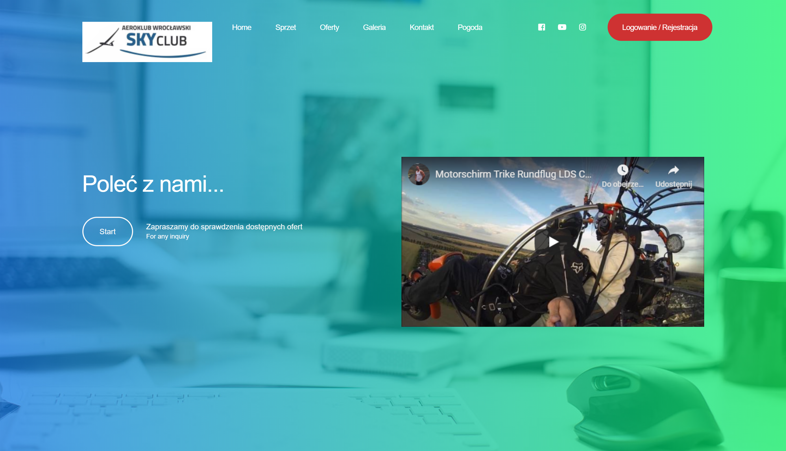

# SkyClub - MotorGliding
Strona wizytówka z możliwością składania zamówień na loty motolotnią. Użytkownik może przeglądać i dodawać wybrane oferty do koszyka. Po złożeniu zamówienia otrzymuje potwierdzenie na podany adres e-mail. Na stronie jest również możliwość podejrzenia warunków pogodowych z zewnetrzengo serwisu.

## Użytkownik ma dostępęp do:
- sowich zamówień,
- edycji swoich danych,
- edycji hasła,
- przy składaniu zamówienia dane są pobierane z konta użytkownika

## Panel administracyjny pozwala:
- zarządzać zamówieniami,
- dodawać/edytować/usuwać pojazdy oraz oferty,
- obsługiwać galerię,
- zarządzać użytkownikami
Kolejne etapy to integracja z serwisami społecznościowymi oraz wprowadzenie płatności automatycznych.

## Użyte technologie:
- ASP.NET Core MVC, ASP.NET Core Identity
- Entity Framework (Code First), baza MSSQL
- Java Script
- filtrowanie zamówień z użyciem wzorca łańcuch odpowiedzialności
Wersja testowa: skyclub.tmarciniak.com.pl

